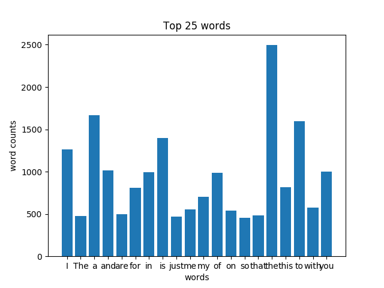

## Application idea
This application streams tweets (in real-time) and iteratively counts the occurrences of individual words. Serving scripts have been written to search for the frequencies of words, filter words with and create a bar chart of the top 20 words. 

The streaming is done with python packages called Tweepy and Streamparse which are  python "wrappers" for the Twitter API and Apache Storm, respectively. All data is stored in postgres using a python package called psycopg2.

## Architecture description


### AWS EC2 instance
We use a custom AWS EC2 instance: UCB MIDS W205 EX2-FULL - ami-d4dd4ec3

### Twitter API
The tweepy library for python is used for streaming data from the Twitter API.

### Apache Storm
We use streamparse as our Storm "wrapper" for python. The package creates necessary project files and a sample topology that are then changed for our application.

### PostgresSQL
We use the psycopg2 python library in order to connect with our postgres database. We create a database called tcount and a table called tweetwordcount that is fed from the final Storm bolts in the topology.

### Python scripts
We use python scripts to query the database and return some descriptive analytics on the words and their frequencies that we've collected.


## Directory/File Structure
Notable and important files/processes/scripts are highlighted below. Note, this does not cover the entire directory, missing files may include streamparse project files, git configuration files, etc.
```
| W205-Exercise-2
|-- extweetwordcount                #streamparse application
    |-- src
        |--bolts
            |--wourdcount.py        #wordcount bolt file
            |--parse.py             #parse bolt file
        |--spouts
            |--tweets.py            #tweet spout file
|-- barplot_png.py                  #creates bar plot of top 20 words
|-- Plot.png                        #output of barplot_png.py
|-- finalresults.py                 #shows all word, count pairings
|-- histogram.py                    #lists words within specified range
|-- requirements.txt                #includes list of python package dependencies
|-- setup_db.py                     #must be run before sparse application can run
|-- Twittercredentials.py           #you must edit this with your credentials
```

In our Postgres database, setup_db.py will create a database called tcount and a table called tweetwordcount.

## File dependencies
Ensure all package dependencies are installed. We will be using packages like tweepy and psycopg2. Run the following code to install all necessary packages when in the parent directory:
```
pip install -r requirements.txt
```

## Running the application

### 1. Environment and Tool Setup
Start up an EC2 instance with the "UCB MIDS w205 EX2-FULL" AMI and an EBS volume. Ensure your environment is setup correctly (mount external disc to /data and start postgres):
```
mount -t ext4 /dev/xvdf /data
/data/start_postgres.sh
```

Clone the repo in your desired location:
```
git clone https://github.com/jrosenfeld13/W205-Exercise-2.git
cd W205-Exercise-2/
```

Ensure all package dependencies are installed. We will be using packages like tweepy and psycopg2. Run the following code to install all necessary packages:
```
pip install -r requirements.txt
```

### 2. Streaming and storing
In order to run the Storm cluster and streamparse (sparse) application, run the following:

```
python setup_db.py

cd /extweetwordcount
sparse run
```
(NOTE: setup_db.py must be run each time before starting the sparse app)


### 3. Serving scripts
We can query the continuously updating postgresql data table with the following scripts:
##### finalresults.py
This script prints the words alphabetically next to their occurences
```
python finalresults.py
```

or use an optional search argument to get the occurences of just that word
```
python finalresults.py Trump
```

#### histogram.py
```
python histogram.py
```

#### barplot_png.py
barplot_png.py is an optional script included to create a matplotlib bar chart of the top 20 words with their counts and save it as a .png.
```
python barplot_png.py
```

##### Output

